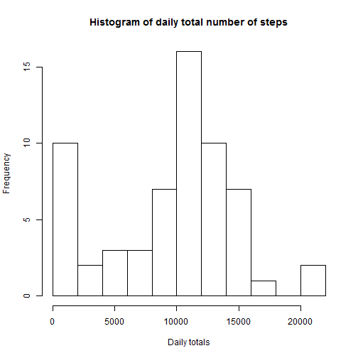
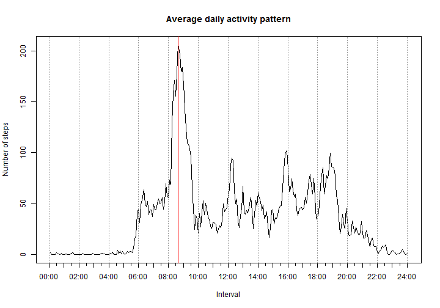
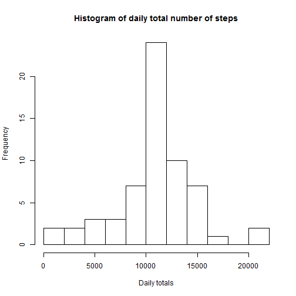
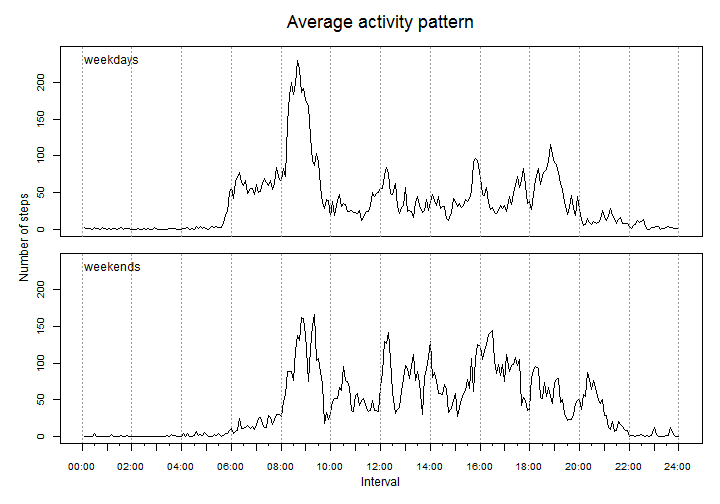

# Reproducible Research: Peer Assessment 1

In this report, part of an assignment from the Coursera's Reproducible Research online course, we present an analysis of data generated by a personal activity monitoring device or activity tracker, like Fitbit, Nike Fuelband, or Jawbone Up, worn by an anonymous individual over a two-month period in 2012.

The data for this assignment was previously downloaded from the course web site:

* Dataset: [Activity monitoring data](https://d396qusza40orc.cloudfront.net/repdata%2Fdata%2Factivity.zip) [52K]

## Loading and preprocessing the data

We start by loading the unzipped data from working directory and looking at its structure.

```r
activity = read.csv("activity.csv")
str(activity)
```

```
## 'data.frame':	17568 obs. of  3 variables:
##  $ steps   : int  NA NA NA NA NA NA NA NA NA NA ...
##  $ date    : Factor w/ 61 levels "2012-10-01","2012-10-02",..: 1 1 1 1 1 1 1 1 1 1 ...
##  $ interval: int  0 5 10 15 20 25 30 35 40 45 ...
```


There are 17,568 observations of 3 variables, with some NA's in the first one. These are their descriptions, according to the assignment instructions:
* **steps**: Number of steps taking in a 5-minute interval (missing
    values are coded as `NA`)

* **date**: The date on which the measurement was taken in YYYY-MM-DD
    format

* **interval**: Identifier for the 5-minute interval in which
    measurement was taken


We think it's better to convert the **date** variable to an object of class "Date", and the **interval** variable to a properly formatted string.

Having interval identifiers as integers might cause undesired "gaps" in the x-axis scale of time series plots. Because it represents time and there's no identifier ending in 60, 65, 70, and so on, the scale would have a "gap" between, for example, 255 and 300 (250 255 ... 300 305). Converting it to string avoids this problem.

```r
activity$date = as.Date(activity$date)
activity$interval = strftime(strptime(sprintf("%04d", activity$interval), "%H%M"), 
    "%H:%M")
str(activity)
```

```
## 'data.frame':	17568 obs. of  3 variables:
##  $ steps   : int  NA NA NA NA NA NA NA NA NA NA ...
##  $ date    : Date, format: "2012-10-01" "2012-10-01" ...
##  $ interval: chr  "00:00" "00:05" "00:10" "00:15" ...
```


## What is mean total number of steps taken per day?
Now, we are ready to explore this data more closely. Let's make a histogram of the total number of steps taken each day.

```r
daily.total = c(with(activity, tapply(steps, date, sum, na.rm = TRUE)))
hist(daily.total, breaks = 9, main = "Histogram of daily total number of steps", 
    xlab = "Daily totals")
```

 


We see that the most common daily figure is around and over 10,000 steps. We can also see that there are a high number of days with zero or very low number of steps, probably due to the presence of NA's in the data, and this might affect statistics like the mean. Let's take a look at these summaries.


```r
(daily.mean = mean(daily.total, na.rm = TRUE))
```

```
## [1] 9354
```

```r
(daily.median = median(daily.total, na.rm = TRUE))
```

```
## [1] 10395
```

Notice that the mean of daily number of steps (9354.2295) is lower than the median (10395) and under 10,000 steps.

## What is the average daily activity pattern?

To look into the daily activity pattern, we'll make a time series plot of the 5-minute interval and the average number of steps taken, averaged across all days.


```r
interval.mean = c(with(activity, tapply(steps, interval, mean, na.rm = TRUE)))
plot(interval.mean, type = "l", main = "Average daily activity pattern", xlab = "Interval", 
    ylab = "Number of steps", xaxt = "n")

# Build a custom x-axis
ticks = seq(from = 0, to = 288, by = 12)
x.axis.labels = c(names(interval.mean), "24:00")
axis(1, at = ticks, labels = x.axis.labels[ticks + 1])
axis(1, at = seq(from = 0, to = 288, by = 6), labels = NA, tck = -0.01)
abline(v = seq(from = 0, to = 288, by = 24), col = "gray60", lty = "dotted")
abline(v = which.max(interval.mean), col = "red", lty = "solid")
```

 


```r
max(interval.mean)
```

```
## [1] 206.2
```

```r
names(which.max(interval.mean))
```

```
## [1] "08:35"
```

The red vertical line marks the 5-minute interval starting at **08:35**, which contains the maximum number of steps, on average, across all days. In our case, this maximum is **206.1698 steps**.

## Imputing missing values

As previously noted, there are some missing values. Let's investigate that.

```r
summary(activity)
```

```
##      steps            date              interval        
##  Min.   :  0.0   Min.   :2012-10-01   Length:17568      
##  1st Qu.:  0.0   1st Qu.:2012-10-16   Class :character  
##  Median :  0.0   Median :2012-10-31   Mode  :character  
##  Mean   : 37.4   Mean   :2012-10-31                     
##  3rd Qu.: 12.0   3rd Qu.:2012-11-15                     
##  Max.   :806.0   Max.   :2012-11-30                     
##  NA's   :2304
```

```r
sum(!complete.cases(activity))
```

```
## [1] 2304
```


Notice that the missing values are confined to the **steps** variable. To deal with these **2304** incomplete rows which, as we've seen, may introduce bias into some calculations or summaries of the data, we'll create a copy of the dataset and replace all NA values with the average number of steps taken in each 5-minute interval. They are stored in the **interval.mean** variable, calculated a few steps ago.


```r
stepsNA = is.na(activity$steps)
activity.c <- within(activity, {
    steps[stepsNA] = interval.mean[interval[stepsNA]]
})
```

Let's take a look at the imputed dataset and calculate some summaries on it.

```r
summary(activity.c)
```

```
##      steps            date              interval        
##  Min.   :  0.0   Min.   :2012-10-01   Length:17568      
##  1st Qu.:  0.0   1st Qu.:2012-10-16   Class :character  
##  Median :  0.0   Median :2012-10-31   Mode  :character  
##  Mean   : 37.4   Mean   :2012-10-31                     
##  3rd Qu.: 27.0   3rd Qu.:2012-11-15                     
##  Max.   :806.0   Max.   :2012-11-30
```

```r
daily.total.c = c(with(activity.c, tapply(steps, date, sum)))
(daily.mean.c = mean(daily.total.c))
```

```
## [1] 10766
```

```r
(daily.median.c = median(daily.total.c))
```

```
## [1] 10766
```


See how the mean is now equal to the median and both agree with our intuitively notion that the most common daily activity is over 10,000 steps.

Let's make a histogram similar to the previous one and see how they differ.

```r
hist(daily.total.c, breaks = 9, main = "Histogram of daily total number of steps", 
    xlab = "Daily totals")
```

 

We can see that the new histogram sligthly resembles one of a normal distribution.

## Are there differences in activity patterns between weekdays and weekends?

Now, we're going to investigate if there are any difference in activity patterns between weekdays and weekends. To get that, we'll create a new factor variable with two levels -- "weekday" and "weekend" indicating whether a given date is a weekday or weekend day.

```r
wday = as.POSIXlt(activity.c$date)$wday
activity.c$weekday = as.factor(c("weekday", "weekend")[(wday == 0 | wday == 
    6) + 1])
```


Now, we'll make a panel plot with two time series plots, one for each kind of day.

```r
# Average steps from each interval and weekday status
weekday.mean = with(activity.c, tapply(steps, list(weekday, interval), mean))

# Set panel for two plots
old_par = par(mfrow = c(2, 1), oma = c(4, 4, 2, 1) + 0.1, mar = c(0, 0, 1, 0) + 
    0.1)

# Define common scale to y-axis
ylim = c(0, round(max(weekday.mean) + 5, -1))

# plot
for (i in 1:2) {
    plot(weekday.mean[i, ], type = "l", xaxt = "n", ylim = ylim, cex.axis = 0.8)
    abline(v = seq(from = 0, to = 288, by = 24), col = "gray60", lty = "dotted")
    text(1, ylim[2], paste0(rownames(weekday.mean)[i], "s"), adj = c(0, 1))
}
# titles
mtext("Average activity pattern", side = 3, line = 0, cex = 1.5, outer = TRUE)
mtext("Number of steps", side = 2, line = 2, cex = 1, outer = TRUE)
mtext("Interval", side = 1, line = 2, cex = 1, outer = TRUE)

# Custom x-axis
ticks = seq(from = 0, to = 288, by = 12)
axis(1, at = ticks, labels = x.axis.labels[ticks + 1], cex.axis = 0.8)
axis(1, at = seq(from = 0, to = 288, by = 6), labels = NA, tck = -0.01)
```

 


We can see that, in weekdays, activity is highly concentrated around the 08:35-08:40 interval. In weekends, activity is more evenly distributed.

The average number of steps in weekends is almost 2,000 higher than in weekdays, as we can see below.


```r
rowSums(weekday.mean)
```

```
## weekday weekend 
##   10256   12202
```

